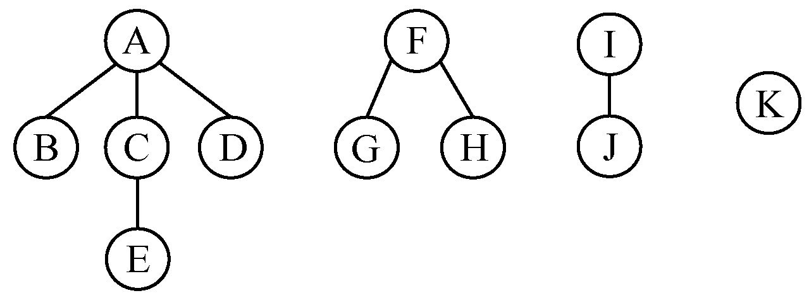
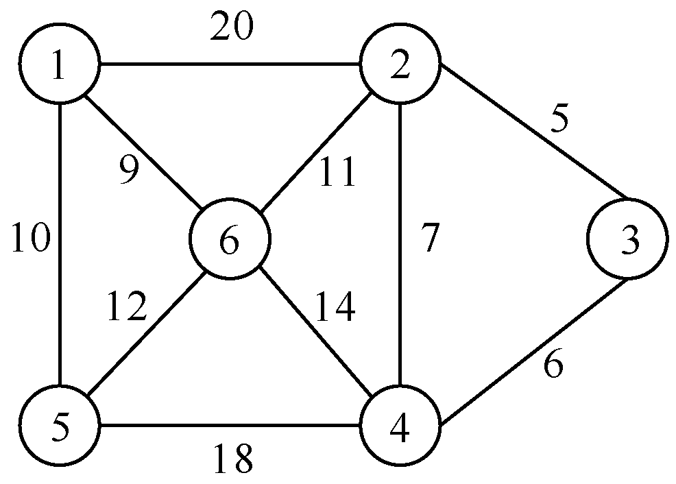
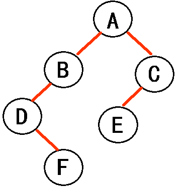
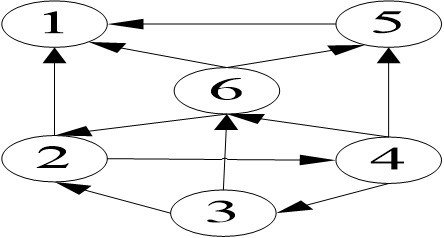
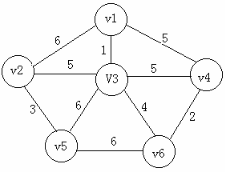

# 数据结构与算法分析复习题

## 一、单选题

1. 在单链表中，增加头结点的目的是（ ）。

   A. 使单链表至少有一个结点  
   B. 标志表中首结点的位置  
   C. 方便运算的实现  
   D. 说明该单链表是线性表的链式存储结构

   **答案：C**
   
   **解析：** 头结点的主要作用是统一对第一个结点和其他结点的操作，避免在首位置插入删除时的特殊处理，使算法更简洁。

2. 在顺序表中，只要知道（ ）。

   A. 基地址  
   B. 结点大小  
   C. 向量大小  
   D. 基地址和结点大小

   **答案：D**
   
   **解析：** 顺序表采用随机访问，地址计算公式为：loc(ai) = loc(a0) + i×L，需要基地址和结点大小两个参数。

3. 下面关于线性表的叙述，错误的是（ ）。

   A. 线性表采用顺序存储，必须占用一片地址连续的单元
   B. 线性表采用顺序存储，便于进行插入和删除操作
   C. 线性表采用链式存储，不必占用一片地址连续的单元
   D. 线性表采用链式存储，便于进行插入和删除操作

   **答案：B**
   
   **解析：** 顺序存储需要移动大量元素，插入删除效率低；链式存储只需修改指针，便于插入删除。

4. 在单链表指针为p的结点之后插入指针为s结点，正确的操作是（ ）。

   A. p->link=s；s->link=p->link；  
   B. s->link=p->link；p->link=s；  
   C. p->link=s；p->link=s->link；  
   D. p->link=s->link；p->link=s；

   **答案：B**
   
   **解析：** 先将s的指针域指向p的后继，再将p的指针域指向s，顺序不能颠倒，否则会丢失p的后继信息。

5. 链表中最常用的操作是在最后一个元素之后插入一个元素和删除最后一个元素，则采用（ ）存储方式最节省运算时间。

   A. 单链表  
   B. 双链表  
   C. 单循环链表  
   D. 带头结点的双向循环链表

   **答案：D**
   
   **解析：** 双向循环链表可通过头结点直接访问尾结点，删除时能直接找到前驱，时间复杂度 $O(1)$。

6. 链表不具备的特点是（ ）。

   A. 随机访问  
   B. 不必事先估计存储空间  
   C. 插入删除时不需移动元素  
   D. 所需空间与线性表成正比

   **答案：A**
   
   **解析：** 链表必须从头结点开始顺序访问，不支持随机访问，时间复杂度 $O(n)$；只有顺序表支持 $O(1)$ 随机访问。

7. 在（ ）的运算中，使用顺序表比链表好。

   A. 插入  
   B. 根据序号查找  
   C. 删除  
   D. 根据元素查找

   **答案：B**
   
   **解析：** 顺序表支持按序号随机访问，时间复杂度 $O(1)$；链表需要遍历，时间复杂度 $O(n)$。

8. 能在 $O(1)$ 时间内访问线性表的第i个元素的结构是（ ）。

   A. 顺序表  
   B. 单链表  
   C. 单向循环链表  
   D. 双向链表

   **答案：A**
   
   **解析：** 顺序表采用数组存储，通过下标可直接计算地址，实现 $O(1)$ 随机访问；链表需遍历。

9. 在一棵二叉树上第3层上的结点数最多为（ ）。

   A. 2  
   B. 4  
   C. 6  
   D. 8

   **答案：B**
   
   **解析：** 二叉树第k层最多有 $2^{k-1}$ 个结点，第3层最多 $2^{3-1}=2^2=4$ 个结点。

10. 在完全二叉树中，如果一个结点是叶子结点，则它没有（ ）。

    A. 左孩子结点  
    B. 右孩子结点  
    C. 左、右孩子结点  
    D. 左、右孩子结点和兄弟结点

    **答案：C**
    
    **解析：** 叶子结点定义为没有孩子的结点，即左右孩子都不存在；但可能有兄弟结点。

11. 若已知一个栈的入栈序列是1，2，3，…，n，其输出序列为p1，p2，p3，…，pn，若pn是n，则Pi为（ ）。

    A. i  
    B. n－i  
    C. n－i＋l  
    D. 不确定

    **答案：A**
    
    **解析：** 若最后出栈的是n，说明n最后入栈，则1,2,…,n依次入栈后依次出栈，输出序列为1,2,…,n，故Pi=i。

12. 在一个链队列中，若f、r分别为队首、队尾指针，则插入p所指结点的操作为（ ）。

    A. f->link=p；f=p  
    B. r->link=p；r=p  
    C. p->link=r；r=p  
    D. p->link=f；f=p

    **答案：B**
    
    **解析：** 队列在队尾插入，将当前队尾的next指向新结点p，再将队尾指针r移向p。

13. 假设在一棵二叉树中，双分支结点数为15，单分支结点数为30个，则叶子结点数为（ ）个。

    A. 15  
    B. 16  
    C. 17  
    D. 47

    **答案：B**
    
    **解析：** 二叉树性质：n0=n2+1，其中n0为叶子数，n2为双分支数。n0=15+1=16。

14. 树最适合用来表示（ ）。

    A. 有序数据元素  
    B. 元素之间具有分支层次关系的数据  
    C. 无序数据元素  
    D. 元素之间无联系的数据

    **答案：B**
    
    **解析：** 树形结构的特点是一对多的层次关系，适合表示具有分支和层次的数据，如文件系统、组织结构等。

15. 一个栈的入栈序列是a，b，c，d，e，则栈的不可能的输出序列是（ ）。

    A. edcba  
    B. decba  
    C. dceab  
    D. abcde

    **答案：C**
    
    **解析：** 若d先出栈，则c、e应在栈中，c在e下方，c不可能比e先出。dceab违反了栈的后进先出原则。

16. 计算机算法必须具备输入、输出、（ ）等5个特性。

    A. 可行性、可移植性和可扩展性  
    B. 可行性、确定性和有穷性  
    C. 确定性、有穷性和稳定性  
    D. 易读性、安全性和稳定性

    **答案：B**
    
    **解析：** 算法五大特性：输入、输出、有穷性（有限步骤）、确定性（无二义性）、可行性（可执行）。

17. 一个三元组表用于表示一个（ ）。

    A. 线性表  
    B. 广义表  
    C. 稀疏矩阵  
    D. 双向链表

    **答案：C**
    
    **解析：** 三元组(行,列,值)专用于稀疏矩阵压缩存储，只存储非零元素，大幅节省空间。

18. 深度为4的满二叉树有（ ）个结点。

    A. 32  
    B. 15  
    C. 30  
    D. 31

    **答案：B**
    
    **解析：** 深度为k的满二叉树结点数为 $2^k-1$，深度4的满二叉树有 $2^4-1=15$ 个结点。

19. 边数很多的稠密图，适宜用（ ）表示。

    A. 邻接矩阵  
    B. 邻接表  
    C. 逆邻接表  
    D. 邻接多重表

    **答案：A**
    
    **解析：** 稠密图边数多，邻接矩阵空间利用率高；稀疏图用邻接表节省空间。

20. 数据结构是一门研究非数值计算的程序设计问题中计算机的操作对象以及它们之间的（ ）和运算的学科。

    A. 结构  
    B. 关系  
    C. 存储  
    D. 算法

    **答案：B**
    
    **解析：** 数据结构研究数据元素之间的关系（逻辑关系和存储关系）以及对数据的操作运算。

21. 算法在发生非法操作时可以作出处理的特性称为（ ）。

    A. 正确性  
    B. 易读性  
    C. 健壮性  
    D. 可靠性

    **答案：C**
    
    **解析：** 健壮性指算法能对非法输入或异常情况作出恰当处理，不会崩溃。

22. 将一棵有100个结点的完全二叉树从上到下，从左到右依次进行编号，根结点的编号为1，则编号为25的结点的左孩子编号为（ ）。

    A. 51  
    B. 99  
    C. 50  
    D. 没有右孩子

    **答案：C**
    
    **解析：** 完全二叉树顺序存储，结点 $i$ 的左孩子编号为 $2i$，右孩子为 $2i+1$。编号25的左孩子为 $2 \times 25 = 50$。

23. 设三个函数 $f$，$g$，$h$ 分别为 $f(n)=100n^3+n^2+100$， $g(n)=25n^3+4000n$， $h(n)=n^{1.5}+100\log_2 n$，则以下关系式中错误的是（ ）。

    A. f(n)=$O(g(n))$  
    B. g(n)=$O(f(n))$  
    C. h(n)=$O(n^{1.5})$  
    D. h(n)=$O(\log_2 n)$

    **答案：D**
    
    **解析：** $h(n)=n^{1.5}+100\log n$ 的最高阶项是 $n^{1.5}$， $n^{1.5}$ 增长快于 $\log n$，所以 $h(n)=O(n^{1.5})$ 而不是 $O(\log n)$。

24. 一个队列的入队序列是1，2，3，4，则队列的输出序列是（ ）。

    A. 4,3,2,1  
    B. 1,2,3,4  
    C. 1,4,3,2  
    D. 3,2,4,1

    **答案：B**
    
    **解析：** 队列遵循先进先出(FIFO)原则，入队顺序和出队顺序一致。

25. 线性表L在（ ）情况下适用于使用链式结构实现。

    A. 需经常修改L中的结点值  
    B. 需不断对L进行删除、插入  
    C. L中含有大量的结点  
    D. L中结点结构复杂

    **答案：B**
    
    **解析：** 链表的优势是插入删除操作方便，不需移动大量元素，适合频繁修改结构的场景。

26. 一个三元组表用于表示一个（ ）。

    A. 线性表  
    B. 广义表  
    C. 双向链表  
    D. 稀疏矩阵

    **答案：D**
    
    **解析：** 三元组(行,列,值)专用于稀疏矩阵压缩存储，只存储非零元素。

27. 深度为5的满二叉树有（ ）个分支结点。

    A. 32  
    B. 15  
    C. 30  
    D. 31

    **答案：B**
    
    **解析：** 满二叉树总结点数=$2^5-1=31$，叶子数=$2^4=16$，分支结点数=$31-16=15$。

28. 边数很多的稠密图，适宜用（ ）表示。

    A. 邻接矩阵  
    B. 邻接表  
    C. 逆邻接表  
    D. 邻接多重表
    **答案：A**
    
    **解析：** 稠密图边多，邻接矩阵空间利用率高，访问效率也 $O(1)$。

29. 若从二叉树的任一结点出发到根的路径上所经过的结点序列按其关键字有序，则该二叉树是（ ）。

    A. 二叉排序树  
    B. 二叉平衡树  
    C. 堆  
    D. B树

    **答案：C**
    
    **解析：** 堆的特征是任意结点到根路径上的值有序（大根堆递增，小根堆递减）。

30. 算法在发生非法操作时可以作出处理的特性称为（ ）。

    A. 正确性  
    B. 易读性  
    C. 健壮性  
    D. 可靠性

    **答案：C**
    
    **解析：** 健壮性指算法能处理异常情况和非法输入，不会出现错误。

31. 将一棵有100个结点的完全二叉树从上到下，从左到右依次进行编号，根结点的编号为1，则编号为49的结点的右孩子编号为（ ）。

    A. 98  
    B. 99  
    C. 50  
    D. 没有右孩子

    **答案：B**
    
    **解析：** 完全二叉树顺序存储，结点 $i$ 的右孩子编号为 $2i+1$。编号49的右孩子为 $2 \times 49 + 1 = 99$。


## 二、填空题

1. 若对一个线性表经常进行查找操作，而很少进行插入和删除操作时，则采用 ________ 存储结构为宜，相反，若经常进行的是插入和删除操作时，则采用 ________ 存储结构为宜。

   **答案：** 顺序存储（顺序表）、链式存储（链表）
   
   **解析：** 顺序表支持随机访问，查找 $O(1)$；链表插入删除只需修改指针，$O(1)$ 完成。

2. 在双向链表中，每个结点有两个指针域，一个指向其 ________ 结点，另一个指向其 ________ 结点。

   **答案：** 前驱（前一个）、后继（后一个）
   
   **解析：** 双向链表每个结点有prior和next两个指针，分别指向前驱和后继，支持双向遍历。

3. 字符串按存储方式可以分为 ________、链接存储和堆分配存储；在C语言中，以字符 ________ 表示串值的终结。

   **答案：** 顺序存储（定长顺序存储）、'\0'（空字符）
   
   **解析：** 字符串三种存储：定长顺序、堆分配、块链；C语言用'\0'作结束标记。

4. 约定i（1≤i≤n）为逻辑位序，在长度为n的顺序表中，若要删除第i个元素，需向前移动 ________ 个元素；若要在第i个元素前插入一个元素，则需向后移动 ________ 个元素。
   **答案：** n-i、n-i+1
   
   **解析：** 删除第i个，需移动i+1至n共n-i个；插入在第i位置，需移动i至n共n-i+1个元素。

5. 字符串是由有限个字符组成的线性结构，设字符串s = "abcde"，则其长度为 ________；若采用0基索引（存储时下标从0开始），字符'c'对应的下标是 ________。
   **答案：** 5、2
   
   **解析：** 字符串"abcde"有5个字符，长度为5；使用0基索引，a(0),b(1),c(2),d(3),e(4)，c对应下标2。

6. 哈夫曼树是指带权路径长度最小的二叉树，现由带权为3，6，2，5的4个叶子结点构成的一棵哈夫曼树，则带权路径长度为 ________；该二叉树一共含有 ________ 个结点。

   **答案：** 35、7
   
   **解析：** 构造过程：(2,3)→5,(5,5)→10,(6,10)→16。WPL=$2×3+2×2+2×5+1×6=35$。结点数=$2n-1=2×4-1=7$。

7. 散列表（哈希表）的核心思想是通过 ________ 函数将关键字映射到表中的指定位置；若两个不同关键字通过该函数得到相同的映射位置，则称这种现象为 ________。

   **答案：** 散列（哈希/Hash）、冲突（碰撞）
   
   **解析：** 散列表通过哈希函数将关键字直接映射到地址；不同关键字映射到同一地址称为冲突。

8. 对于给定的n个元素，可以构造出的逻辑结构有 ________、________、________ 和图结构。

   **答案：** 集合、线性结构、树形结构
   
   **解析：** 数据的四种基本逻辑结构：集合（无关系）、线性结构（一对一）、树形结构（一对多）、图结构（多对多）。

9. 图结构中的数据元素之间具有 ________ 的关系；图的存储表示有 ________、________、十字链表法和邻接多重表法；若图G的顶点集合为V(G) = {0，1，2，3，4}，边集E(G) = {<0,1>，<1,2>，<2,0>，<2,4>，<3,0>，<3,2>，<3,4>，<4,0>}，则顶点2的入度为 ________，顶点0的出度为 ________。

   **答案：** 多对多、邻接矩阵、邻接表、2、1
   
   **解析：** 图为多对多关系；顶点2的入度：有<1,2>和<3,2>两条边指向它，入度为2；顶点0的出度：有<0,1>一条边从它出发，出度为1。

10. 二维数组A[4][3]中数组元素以行优先顺序存储，已知数组A的起始存储位置（基地址loc(A[0][0])为100，一个数组元素占4个单位存储空间，则数组元素A[3][2]的存储地址为 ________；三维数组A[5][4][3]中数组元素以行优先顺序存储，已知数组A的起始存储位置（基地址loc(A[0][0][0])为100，一个数组元素占4个单位存储空间，则数组元素A[2][2][2]的存储地址为 ________。

   **答案：** 144、204
   
   **解析：** A[3][2]: $100+(3×3+2)×4=144$。A[2][2][2]: $100+(2×4×3+2×3+2)×4=100+26×4=204$。

11. 哈夫曼树是具有 ________ 的最优二叉树；若一颗哈夫曼树含有n个叶节点，则其结点总数为 ________。

   **答案：** 最小带权路径长度、2n-1
   
   **解析：** 哈夫曼树目标是使WPL最小；n个叶子需n-1次合并，总结点数=$n+(n-1)=2n-1$。

12. 单链表中设置头结点的作用是 ________，当删除某一指定结点时，必须找到该结点的 ________ 结点。

   **答案：** 统一操作（简化操作/方便运算）、前驱
   
   **解析：** 头结点统一了第一个结点的操作；单链表删除需修改前驱的next指针，必须知道前驱。

13. 衡量一个算法的效率可分为 ________ 效率和 ________ 效率。

   **答案：** 时间、空间
   
   **解析：** 算法效率包括时间复杂度（执行时间）和空间复杂度（内存占用）两个方面。


## 三、判断题

1. 线性表的链式存储结构优于顺序存储结构。（ ）

   **答案：×**
   
   **解析：** 两种结构各有优劣，顺序表支持随机访问，链表便于插入删除，不存在绝对优劣。

2. 链表的每个结点都恰好包含一个指针域。（ ）

   **答案：×**
   
   **解析：** 单链表有一个指针，双向链表有两个指针，循环链表等也有不同结构。

3. 顺序表的每个结点只能是一个简单类型，而链表的每个结点可以是一个复杂类型。（ ）

   **答案：×**
   
   **解析：** 顺序表和链表的结点都可以是简单或复杂类型，与存储结构无关。

4. 在图的遍历中，广度优先搜索可以找到从起点到终点的最短路径。（ ）

   **答案：√**
   
   **解析：** 在无权图中，BFS按层次遍历，第一次访问到的路径即为最短路径（边数最少）。

5. 带权图最小生成树是唯一的。（ ）

   **答案：×**
   
   **解析：** 当存在相同权值的边时，可能生成多个不同的最小生成树，但权值和相同。

6. 数据的逻辑结构和数据的存储结构是相同的。（ ）

   **答案：×**
   
   **解析：** 逻辑结构是数据元素间的关系，存储结构是在计算机中的存储方式，两者不同。

7. 串是n个字母的有限序列（n≥0）。（ ）

   **答案：√**
   
   **解析：** 字符串是有限个字符组成的序列，n≥0表示允许空串存在。

8. 从逻辑关系上讲，数据结构主要分为线性结构和非线性结构两类。（ ）

   **答案：√**
   
   **解析：** 数据结构按逻辑关系分为线性结构（一对一）和非线性结构（一对多、多对多）。

9. 图可以没有边，但不能没有顶点。（ ）

   **答案：√**
   
   **解析：** 图必须有顶点集，但边集可以为空（无连接的孤立顶点）。

10. 插入和删除操作是数据结构中最基本的两种操作，所以这两种操作在数组中也经常使用。（ ）

    **答案：×**
    
    **解析：** 数组不适合频繁插入删除，需要移动大量元素，时间复杂度高，不经常用。

11. 在图的遍历中，深度优先搜索使用栈来存储待访问的节点。（ ）

    **答案：√**
    
    **解析：** DFS使用栈（递归或显式栈）实现，先深入后回溯；BFS使用队列。

12. 任何一个递归过程都可以转换成非递归过程。（ ）

    **答案：√**
    
    **解析：** 所有递归都可用栈模拟，转化为非递归形式，但可能复杂度增加。

13. 串中任意个字符组成的子序列称为该串的子串。（ ）

    **答案：×**
    
    **解析：** 子串必须是连续的字符序列，而子序列可以不连续，两者不同。

14. 数据结构的抽象操作的定义与具体实现有关。（ ）

    **答案：×**
    
    **解析：** 抽象操作的定义独立于实现，只描述功能而不涉及具体实现细节。

15. 若输入序列为1,2,3,4,5,6，则通过一个栈可以输出序列1,3,5,4,2,6。（ ）

    **答案：×**
    
    **解析：** 模拟：1进出，2进，3进出，4进，5进出，此时4在栈顶，不能先出2再出6，不可能。

16. 数据的物理结构是指数据在计算机内的实际存储形式。（ ）

    **答案：√**
    
    **解析：** 物理结构即存储结构，指数据在计算机内存中的具体存储方式。

17. 在二叉搜索树中，左子树的所有节点的值都小于根节点的值。（ ）

    **答案：√**
    
    **解析：** 二叉搜索树(BST)定义：左子树所有节点<根节点<右子树所有节点。

18. 哈希表的平均查找时间复杂度为 $O(1)$。（ ）

   **答案：√**
   
   **解析：** 理想情况下，哈希表通过计算直接定位，平均时间复杂度为 $O(1)$。

19. 快速排序算法的时间复杂度总是 $O(n^2)$。（ ）

   **答案：×**
   
   **解析：** 快速排序平均 $O(\log n)$，最坏情况（完全有序）才是 $O(n^2)$。

20. 在图的深度优先搜索中，每个节点最多被访问一次。（ ）

    **答案：√**
    
    **解析：** DFS使用visited标记，确保每个节点只访问一次，避免死循环。

21. 广度优先搜索算法使用队列来存储待访问的节点。（ ）

    **答案：√**
    
    **解析：** BFS使用队列实现，按层次逐层访问，先进先出。

22. 二叉树的前序遍历顺序是先访问根节点，然后左子树，最后右子树。（ ）

    **答案：√**
    
    **解析：** 前序遍历：根→左→右；中序：左→根→右；后序：左→右→根。

23. 在堆排序中，父节点的值总是大于其子节点的值。（ ）

    **答案：×**
    
    **解析：** 大根堆父节点≥子节点，小根堆父节点≤子节点，不总是大于。

24. 动态规划算法通常用于解决具有重叠子问题和最优子结构的问题。（ ）

    **答案：√**
    
    **解析：** 动态规划适用于有重叠子问题和最优子结构的问题，通过保存中间结果避免重复计算。

25. 图的邻接矩阵表示法的空间复杂度为 $O(V+E)$，其中V是顶点数，E是边数。（ ）

   **答案：×**
   
   **解析：** 邻接矩阵空间复杂度为 $O(V^2)$，邻接表才是 $O(V+E)$。

26. AVL树是一种自平衡二叉搜索树，其任意节点的两个子树的高度差最多为2。（ ）

    **答案：×**
    
    **解析：** AVL树平衡因子（左右子树高度差）最多为1，不是2。

27. 归并排序算法的时间复杂度为 $O(\log n)$。（ ）

   **答案：√**
   
   **解析：** 归并排序采用分治策略，无论最好最坏都是 $O(\log n)$，稳定排序。

28. 二分查找算法可以在无序数组中有效运行。（ ）

    **答案：×**
    
    **解析：** 二分查找要求数据必须有序，无序数组无法使用二分查找。

29. 在哈希表中，冲突可以通过链地址法解决。（ ）

    **答案：√**
    
    **解析：** 链地址法是解决哈希冲突的常用方法，将冲突元素链接成链表。

30. 二叉树的后序遍历顺序是先访问左子树，然后右子树，最后根节点。（ ）

    **答案：√**
    
    **解析：** 后序遍历顺序：左子树→右子树→根节点，先处理子节点再处理根。


## 四、简答题

1. 简述线性表中"顺序表"和"单链表"的两个主要区别（从存储结构及基本操作特性角度回答）。

   **答案：**
   
   （1）**存储结构**：顺序表采用顺序存储，逻辑相邻的元素物理位置也相邻，占用连续存储空间；单链表采用链式存储，通过指针连接，可存储在不连续的空间。
   
   （2）**操作特性**：顺序表支持随机访问，查找第i个元素 $O(1)$，但插入删除需移动元素 $O(n)$；单链表只能顺序访问 $O(n)$，但插入删除只需修改指针 $O(1)$。

2. 栈、队列和字符串均属于线性结构，简述以下两个问题：

   （1）栈和队列的操作受限特点分别是什么？

   （2）字符串与普通线性表的区别是什么？

   **答案：**
   
   （1）栈是后进先出(LIFO)，只能在栈顶进行插入和删除；队列是先进先出(FIFO)，一端插入另一端删除。
   
   （2）字符串的数据元素仅限于字符；通常以整体作为操作对象，如子串查找、替换等；字符串操作更注重模式匹配而非单个元素操作。

3. 简述线性结构与非线性结构的不同点。

   **答案：**
   
   **线性结构**：数据元素间存在一对一关系，每个元素（除首尾）有唯一前驱和后继，如数组、链表、栈、队列。
   
   **非线性结构**：数据元素间存在一对多或多对多关系，如树（一对多）、图（多对多）。

4. 折半查找判定树是可视化折半查找执行过程的二叉树模型。请完成以下问题：

   （1）折半查找判定树是一类特殊的二叉排序树，试阐述其区别于普通二叉排序树的特性。

   （2）分析判定树高度与折半查找算法时间复杂度的内在关联。

   **答案：**
   
   （1）折半查找判定树是完全二叉树或近似完全二叉树，结构固定由有序序列决定；而普通二叉排序树结构依赖插入顺序，可能退化。
   
   （2）判定树高度h≈log₂(n+1)，查找最多比较h次，因此折半查找时间复杂度为 $O(\log n)$。

5. 什么是递归算法？比较递归和非递归算法的优缺点？

   **答案：**
   
   **递归算法**：在函数或过程中直接或间接调用自身来解决问题。
   
   **优缺点**：
   - 递归：代码简洁清晰，易理解；但可能栈溢出，效率较低。
   - 非递归：效率高，无栈溢出风险；但代码复杂，不易理解。

6. 简述对称矩阵采用压缩存储的核心思路（以行优先存储下三角为例），并说明其相比普通二维数组存储的空间优势。

   **答案：**
   
   **核心思路**：对称矩阵中aij=aji，只需存储下三角（或上三角）元素。按行优先将下三角元素依次存入一维数组。
   
   **空间优势**：n×n矩阵从 $n^2$ 个元素压缩到 $n(n+1)/2$ 个，节省约一半空间。

7. 简述图结构的遍历方法。

   **答案：**
   
   （1）**深度优先搜索(DFS)**：从起点出发，沿一条路径尽可能深入，无法继续时回溯，使用栈实现。
   
   （2）**广度优先搜索(BFS)**：从起点出发，按层次逐层访问，先访问所有邻接点，使用队列实现。

8. 简述稀疏矩阵的概念及其压缩存储方法。

   **答案：**
   
   **概念**：非零元素个数远小于矩阵元素总数的矩阵。
   
   **压缩存储方法**：
   - 三元组表：用(行，列，值)存储每个非零元素
   - 十字链表：用链表结构存储非零元素
   只存储非零元素，大幅节省空间。


## 五、计算题

### 1. 森林转换为二叉树

将图1中的森林转换成一棵二叉树，并对这棵二叉树进行先序、中序和后序遍历，写出其遍历序列。



**答案：**

**转换步骤：**
1. 树1: A-B,C,D → A左子B，B右兄C，C右兄D，C左子E
2. 树2: F-G,H → F左子G，G右兄H
3. 树3: I-J → I左子J  
4. 树4: K独立
5. 各树根连成兄弟：A右子F，F右子I，I右子K

**转换后的二叉树（文字表示）：**

```

        A
       / \
      B   F
       \   / \
        C G   I
       /   \   / \
      E     H J   K
       \
        D

```

**遍历序列：**
- **先序遍历：** A B C E D F G H I J K
- **中序遍历：** B E D C A G H F J K I
- **后序遍历：** E D C B H G J K I F A


### 2. 二叉树遍历

已知一棵二叉树的中序序列和后序序列分别为BCDEAFHG和DECBHGFA，画出这棵二叉树，要求给出转换过程，并写出其先序遍历的序列。

**答案：**

**构造过程：**
1. 后序DECBHGFA，最后A是根
2. 中序BCDEAFHG，A左边是BCDE（左子树），右边是FHG（右子树）
3. 左子树后序DECB，根是B；中序BCDE，B左空，右边CDE
4. CDE中后序DEC，根是C；中序CDE，C左空，右边DE
5. DE中后序DE，根是E；中序DE，D是E的左子
6. 右子树后序HGF，根是F；中序FHG，F左空，右边HG
7. HG中后序HG，根是G；中序HG，H是G的左子

**二叉树结构：**

```

        A
       / \
      B   F
       \   \
        C   G
         \  /
          E H
         /
        D

```

**先序遍历序列：** A B C E D F G H


### 3. 图的邻接表和邻接矩阵

无向网G如图所示，画出G的邻接表和邻接矩阵。



**邻接矩阵：**

|   | 1  | 2  | 3  | 4  | 5  | 6  |
|---|----|----|----|----|----|----|
| 1 | 0  | 20 | ∞  | ∞  | 10 | 9  |
| 2 | 20 | 0  | 5  | 7  | ∞  | 11 |
| 3 | ∞  | 5  | 0  | 6  | ∞  | ∞  |
| 4 | ∞  | 7  | 6  | 0  | 18 | 14 |
| 5 | 10 | ∞  | ∞  | 18 | 0  | 12 |
| 6 | 9  | 11 | ∞  | 14 | 12 | 0  |

**邻接表：**

| 顶点 | 邻接链表 |
|------|----------|
| 1    | →2(20) →5(10) →6(9) |
| 2    | →1(20) →3(5) →4(7) →6(11) |
| 3    | →2(5) →4(6) |
| 4    | →2(7) →3(6) →5(18) →6(14) |
| 5    | →1(10) →4(18) →6(12) |
| 6    | →1(9) →2(11) →4(14) →5(12) |


### 4. 简单选择排序

设待排序数据元素的关键字为80,7,79,57,35,26，请按照简单选择排序算法对这组数据元素进行升序排序，给出每趟排序结果。

**答案：**
- 第1趟：7, 80, 79, 57, 35, 26（选出最小7）
- 第2趟：7, 26, 79, 57, 35, 80（选出26）
- 第3趟：7, 26, 35, 57, 79, 80（选出35）
- 第4趟：7, 26, 35, 57, 79, 80（选出57）
- 第5趟：7, 26, 35, 57, 79, 80（选出79）


### 5. 冒泡排序

设待排序数据元素的关键字为65,78,30,21,80,7，请按照冒泡排序算法对这组数据元素进行排序，给出每趟排序结果。

**答案：**
- 第1趟：65, 30, 21, 78, 7, 80（最大80沉底）
- 第2趟：30, 21, 65, 7, 78, 80（78沉底）
- 第3趟：21, 30, 7, 65, 78, 80（65沉底）
- 第4趟：21, 7, 30, 65, 78, 80（30沉底）
- 第5趟：7, 21, 30, 65, 78, 80（完成）


### 6. 有向图的邻接矩阵

有向图G如图3所示，请写出图G的邻接矩阵。



**答案：**

**邻接矩阵（1表示有边，0表示无边）：**

```

    1  2  3  4  5  6
1 [ 0  0  0  0  1  0 ]
2 [ 1  0  0  1  0  0 ]
3 [ 0  1  0  1  0  0 ]
4 [ 0  0  0  0  1  1 ]
5 [ 1  0  0  0  0  0 ]
6 [ 0  0  0  0  1  0 ]

```

**说明：** 根据图中箭头方向，边为：1→5, 2→1, 2→4, 3→2, 3→4, 4→5, 4→6, 5→1, 6→5


### 7. 二叉树遍历序列

二叉树T如图4所示，写出先序、中序、后序遍历T的序列。



**答案：**

**二叉树结构（根据图3）：**

```

        A
       / \
      B   C
     /     \
    D       E
   /
  F

```

**遍历序列：**
- **先序遍历（根左右）：** A B D F C E
- **中序遍历（左根右）：** F D B A C E
- **后序遍历（左右根）：** F D B E C A


### 8. 构建二叉排序树

顺序给出以下关键字65、23、31、26、7、91、53、15、72、52、49、68，试画出建立的二叉排序树。

**二叉排序树：**

```

            65
           /  \
          23   91
         / \   /
        7  31 72
         \ / \ /
        15 26 53 68
              /
             52
            /
           49

```

**规则：** 左子树 < 根 < 右子树，依次插入各节点即可。


### 9. Kruskal算法构造最小生成树

带权无向图G如图5所示，画出用克鲁斯卡尔(Kruskal)算法构造其最小生成树的每步结果（要求用图表示即可）。



**答案：**

**边按权值排序：**
1→v3: 1, v3→v5: 2, v5→v2: 3, v3→v6: 4, v2→v3: 5(重), v2→v4: 5(重), v1→v3: 5(重), v5→v6: 6, v1→v2: 6(重)

**Kruskal算法步骤（选5条边）：**

步骤1: 选边v1-v3(权值1)，连接v1,v3

```

v1 --- v3    v2    v4    v5    v6

```

步骤2: 选边v3-v5(权值2)，连接v3,v5

```

v1 --- v3 --- v5    v2    v4    v6

```

步骤3: 选边v5-v2(权值3)，连接v5,v2

```

v1 --- v3 --- v5 --- v2    v4    v6

```

步骤4: 选边v3-v6(权值4)，连接v3,v6

```

       v6
       |
v1 --- v3 --- v5 --- v2    v4

```

步骤5: 选边v2-v4(权值5)或v3-v2(权值5)，v3-v2会成环，选v2-v4

```

       v6
       |
v1 --- v3 --- v5 --- v2 --- v4

```

**最小生成树权值和：** 1+2+3+4+5 = 15


## 六、综合应用题

### 1. 带表头结点的单链表插入算法

已知带表头结点的单链表类型定义如下：

```c
typedef struct node {
    int element;      // 数据域
    struct node *link; // 指针域
} Node;

typedef struct headerList {
    Node *head;
    int n;
} HeaderList;

```

假设现已实现带表头结点的单链表的初始化算法`int Init(HeaderList *h)`、销毁算法`void Destroy(HeaderList *h)`和输出算法`void DisplayLinkList(HeaderList *h)`。

完成下列要求：

1. 实现插入算法向单链表中插入3个整数（10、20、30）
2. 主函数中调用上述算法函数完成单链表创建到销毁的完整流程

**解题思路：**

```c
// 插入算法（尾插法）
int Insert(HeaderList *h, int value) {
    Node *newNode = (Node*)malloc(sizeof(Node));
    newNode->element = value;
    newNode->link = NULL;
    
    Node *p = h->head;
    while(p->link != NULL) p = p->link;  // 找到尾结点
    p->link = newNode;
    h->n++;
    return 1;


// 主函数
int main() {
    HeaderList h;
    Init(&h);
    Insert(&h, 10);
    Insert(&h, 20);
    Insert(&h, 30);
    DisplayLinkList(&h);
    Destroy(&h);
    return 0;
}

```

**关键点：** 头结点不存数据，插入需遍历找尾结点；头插法更简单但顺序相反。


### 2. 顺序表的插入算法

已知顺序表定义如下：

```c
typedef struct seqList {
    int n;           // 顺序表长度
    int maxLength;   // 顺序表的最大允许长度
    int *element;    // 顺序表的存储空间的首地址
} SeqList;

```

假设现已实现顺序表的初始化算法`int Init(SeqList *L, int mSize)`，其中mSize表示预先分配的空间数量、销毁算法`void Destroy(SeqList *L)`和输出算法`void DisplaySeqList(SeqList *L)`。

完成下列要求：

1. 实现插入算法向顺序表中插入3个整数（10、20、30）
2. 主函数中调用上述算法完成顺序表创建到销毁的完整流程

**解题思路：**

```c
// 插入算法（尾插）
int Insert(SeqList *L, int value) {
    if(L->n >= L->maxLength) return 0;  // 表满
    L->element[L->n] = value;
    L->n++;
    return 1;


// 主函数
int main() {
    SeqList L;
    Init(&L, 100);
    Insert(&L, 10);
    Insert(&L, 20);
    Insert(&L, 30);
    DisplaySeqList(&L);
    Destroy(&L);
    return 0;
}

```

**关键点：** n表示当前长度，element[n]即为下一个空位；插入指定位置需后移元素。


### 3. 顺序栈的入栈算法

已知顺序栈定义如下：

```c
typedef struct stack {
    int top;        // 顺序栈顶位置下标
    int maxSize;    // 顺序栈的最大允许长度
    int *element;   // 顺序栈的存储空间的首地址
} Stack;

```

假设现已实现顺序栈的初始化算法`int InitStack(Stack *S, int mSize)`，其中mSize表示预先分配的空间数量、销毁算法`void DestroyStack(Stack *S)`和输出算法`void DisplayStack(Stack *S)`。

完成下列要求：

1. 实现入栈算法向顺序栈中入栈3个整数（10、20、30）
2. 主函数中调用上述算法完成顺序栈创建到销毁的完整流程

**解题思路：**

```c
// 入栈算法
int Push(Stack *S, int value) {
    if(S->top >= S->maxSize - 1) return 0;  // 栈满
    S->top++;
    S->element[S->top] = value;
    return 1;


// 主函数
int main() {
    Stack S;
    InitStack(&S, 100);
    Push(&S, 10);
    Push(&S, 20);
    Push(&S, 30);
    DisplayStack(&S);
    DestroyStack(&S);
    return 0;
}

```

**关键点：** top初始化为-1，入栈先top++再赋值；出栈先取值再top--；判断栈空：top==-1；判断栈满：top==maxSize-1。
